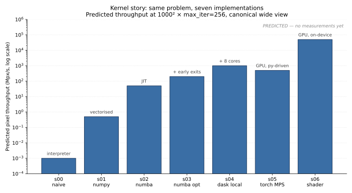
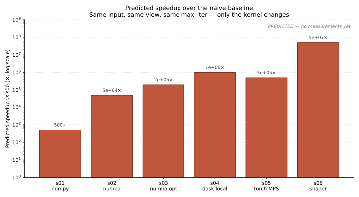
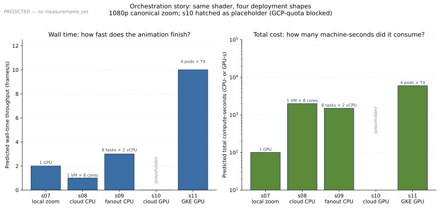

# Scaling

Predicted and measured timing behaviour across the thirteen `mandelflow` stages.

The repo is a scaling study; this doc is the scoreboard. It has three sections:

1. **[Predicted scaling per stage](#predicted-scaling-per-stage)** — what each step is *supposed* to teach, written from the code and the architecture. No measurements required; this is the pedagogical narrative.
2. **[Methodology](#methodology)** — what `bench.record` writes, what `bench.compare` reads, and what's a fair comparison given that each stage targets a different output size.
3. **[Measured results](#measured-results)** — empty tables with hardware columns, ready to be filled in as `bench/results/*.json` lands.

The companion ops doc is [`bench/README.md`](../bench/README.md) (file layout and CLI). This doc owns the *why*.

---

## Scale axes

Three things change across the thirteen stages. Keeping them separate is what makes the chart legible.

| Axis | Range | Where it changes |
|---|---|---|
| **Output size** (pixels × frames) | 200²×1 → ~1080p × 1000 | Per-stage `run.py` defaults |
| **Parallelism** | 1 core → cluster | s04 (cores), s11 (pods) |
| **Hardware** | CPU → GPU | s05/s06 (GPU), s10/s11 (cloud GPU) |

A naive wall-time chart conflates them — s04 looks faster than s00 partly because it's parallel and partly because it's running a Numba kernel under the hood. The fair-comparison view normalises by pixels processed per second per core; see [Methodology](#methodology).

---

## Predicted scaling per stage

Predictions, not measurements. Phrased in orders of magnitude on a reference laptop (Apple Silicon M-series, 8+ cores) unless a cloud or GPU stage forces a different baseline. Refine these as real numbers land.

### Predicted shape

Three sketches of the expected curves, generated from the order-of-magnitude estimates below by `uv run python -m bench.predicted_plots`. They will be overwritten by `bench.compare` once real `bench/results/*.json` files exist.



The kernel story: same input, same view, same `max_iter`. Each step is one of (interpreter → vectorisation → JIT → algorithmic pruning → multi-core → GPU). Log y-axis because the wins span eight orders of magnitude.



The same data as a speedup bar chart against the naive baseline. Useful for the talk — the "how much faster than `for i in range(N)`" framing.



The orchestration story has two axes that move in opposite directions: wall-time *frames/s* (left) goes up with parallelism, while total *compute-seconds consumed* (right, log scale) also goes up — fan-out trades total cost for wall time. s09 and s10 are hatched placeholders; the gap is the point.

### Predicted numbers

| # | Stage | Target scale | Kernel | Dominant cost | Expected wall time per frame | What changed vs prior |
|---|---|---|---|---|---|---|
| 00 | `s00_naive` | 200² × 1 | Triple `for` loop in CPython | Interpreter dispatch (every `z = z*z + c` is a bytecode round-trip) | tens of seconds | — (baseline) |
| 01 | `s01_numpy` | 1000² × 1 | Per-iteration vectorised mask | Memory allocation per iter + global iteration count | seconds | Vectorisation removes the Python inner loop |
| 02 | `s02_numba` | 2000² × 1 | Same algorithm as s00, `@njit`-compiled | Native arithmetic; first call pays JIT (~1 s, cached afterwards) | ~1 s | Native code beats the interpreter and beats NumPy's broadcasting overhead |
| 03 | `s03_numba_opt` | 4000² × 1 | `@vectorize` + `fastmath` + cardioid / period-2 early exits, complex multiply unrolled to reals | Native arithmetic on the *un-pruned* fraction of the plane | sub-second at 4000² for shallow views | Algorithmic pruning, not just kernel speed |
| 04 | `s04_dask_local` | 10000² × 1 | s03 fanned across processes (`LocalCluster`, processes=True) | Per-tile IPC + load imbalance (in-set tiles finish instantly, boundary tiles dominate) | a few seconds at 10000² on 8 cores | Multi-core parallelism on one machine |
| 05 | `s05_gpu_torch` | 16000² × 1 | PyTorch tensor ops, float32, separate real/imag (no `complex64`) | Memory bandwidth + per-iter kernel launch overhead | sub-second on CUDA; a few seconds on MPS | GPU device, but still Python-driven per iteration |
| 06 | `s06_gpu_shader` | 16000² × 1 | GLSL fragment shader; entire iteration loop on-GPU | Fragment shader throughput; one draw call per frame | ~100 ms once the GL context is warm | Per-iteration Python dispatch goes to zero — the win that unlocks deep zoom |
| 07 | `s07_zoom_local` | 100 frames × 1080p | s06 in a Python loop, single GL context reused | Readback to CPU + Zarr write per frame; GL context cost amortised over all frames | ~30–60 s end-to-end | First multi-frame artifact; teaches context amortisation |
| 08 | `s08_zoom_cloud_cpu` | 200 frames × 1080p | s04 kernel on a single GCE VM, output to GCS | Single-VM throughput + network I/O to GCS | ~2–5 min end-to-end | Same kernel, different infrastructure |
| 09 | `s09_zoom_fanout_cpu` | 1000 frames × 1080p | *(placeholder)* | Job scheduling overhead vs frame-batch size | TBD | Multi-machine fan-out on CPU |
| 10 | `s10_zoom_cloud_gpu` | 200 frames × 1080p | *(placeholder, GCP-quota blocked)* | Cloud GPU dispatch + GCS egress | TBD | s06 in the cloud, single VM |
| 11 | `s11_zoom_fanout_gpu` | 1000 frames × 1080p | s06 in a Python loop per pod, N pods on GKE, icechunk-backed Zarr in GCS | Pod cold-start amortised over per-pod frame batches; icechunk commit cadence | TBD; minutes of wall time, hours of GPU-time | Distributed GPU; first stage where the *write path* (icechunk) is load-bearing |
| 12 | `s12_viewer_fastapi` | reads precomputed Zarr | FastAPI tile + frame PNG endpoints | xarray open + chunk read; PNG encode | sub-100 ms per request (cold tile) | Read service, not a compute stage |

### Stage-by-stage notes

The table above is the headline. Below is the intuition each step is supposed to leave you with.

**s00 → s01 — vectorisation.** The naive loop spends ~99% of its time in interpreter overhead, not arithmetic. Moving to per-iteration NumPy masking replaces N×N×max_iter bytecode round-trips with `max_iter` array operations. The win is one to two orders of magnitude, capped by the fact that allocations still happen every iteration and the whole plane is processed even for pixels that escaped on iteration 3.

**s01 → s02 — JIT.** `@njit` on the s00 algorithm beats s01's NumPy version even though s01 is "vectorised". The reason: NumPy carries broadcasting and dtype-promotion overhead per call, and a per-iteration global mask traverses the whole plane every step. Native code with a tight per-pixel loop avoids both.

**s02 → s03 — algorithmic pruning.** Fastmath, complex-multiply-unrolled-to-reals, and the cardioid + period-2 membership tests don't change the asymptotic complexity, but they shave a large constant. The membership tests in particular skip ~40% of the canonical view's pixels entirely, so this is a real algorithmic win, not just a faster kernel.

**s03 → s04 — multi-core.** The kernel from s03 is fanned across processes (not threads — Numba `@vectorize` releases the GIL but the orchestration here uses `LocalCluster(processes=True)` for cleanliness). The expected speedup is sub-linear in core count because of (a) Dask task overhead per tile and (b) severe load imbalance: tiles inside the cardioid finish in microseconds while tiles on the boundary do the full `max_iter` per pixel. Tile shape matters; over-fine tiling drowns in overhead, over-coarse tiling leaves cores idle.

**s04 → s05 — GPU, Python-driven.** PyTorch on CUDA or MPS removes per-pixel work to the GPU, but the iteration loop still runs in Python (each step is a kernel launch). On CUDA that's fine; on MPS the launch overhead is large enough that s05 can be *slower* than s04 for the boundary-heavy canonical view. The lesson is that "GPU" alone isn't the win — moving the loop onto the device is.

**s05 → s06 — GPU, fully on-device.** A GLSL fragment shader runs the entire iteration loop inside the fragment program. There is no Python dispatch per iteration; the only Python call per frame is the draw call. This is what unlocks deep zoom: at `max_iter = 10⁴` the per-iter dispatch cost in s05 dominates, but in s06 it's a single shader uniform.

**s06 → s07 — multi-frame amortisation.** Creating a GL context is expensive (~200 ms). Doing it per frame would dominate the wall time of a 100-frame animation. s07 holds one context open across all frames; the per-frame cost collapses to the shader runtime plus readback plus Zarr write. This is the first stage where the *orchestration shape* (single long-lived context, frame-aligned chunks) is itself load-bearing.

**s07 → s08 — same kernel, different infrastructure.** The compute kernel does not change. What changes is where the bytes land: GCS instead of the local filesystem. The teaching point is the *zero-diff promise* of the Zarr-as-data-product architecture — `to_zarr("gs://bucket/run.zarr")` is the only change. New costs: network egress from the VM to GCS, single-VM throughput cap.

**s08 → s09 — fan-out, CPU.** Frame ranges fan across multiple machines. The interesting question is amortisation: a Cloud Run Job takes ~10 s to cold-start; assigning one frame per task burns 10 s of scheduling for ~1 s of compute. Batch ≈ 10–100 frames per task to keep useful compute > overhead.

**s08/s09 → s10/s11 — GPU in the cloud.** Same fan-out story with GPU per node. The new constraint is icechunk: parallel writers must coordinate through icechunk sessions or chunk writes corrupt. The `IcechunkFrameIOManager` in `orchestration/definitions.py` handles this; the teaching point is that storage-side transactionality is what makes the fan-out architecture work.

**s11 → s12 — read service, not compute.** The viewer is bandwidth-bound, not compute-bound. Latency = `xarray.open_zarr` + chunk fetch + PNG encode. Caching matters more than CPU. Out of scope: on-demand rendering of arbitrary new regions (would require a long-lived GL context per process; see `DESIGN.md` §11).

---

## Methodology

The aim is a fair comparison across stages with very different output sizes. The four numbers we record per run are enough to derive everything else.

### What gets recorded

Each `run.py` writes one JSON to `bench/results/<run-id>.json` via `bench.record(stage_id, run_metadata)`. The JSON shape:

```json
{
  "stage_id": "s03_numba_opt",
  "stage_name": "Numba @vectorize + fastmath + early exits",
  "git_sha": "6394d23",
  "timestamp": "2026-05-17T18:42:11Z",
  "hardware": {
    "platform": "Darwin-25.3.0-arm64-arm-64bit",
    "cpu": "Apple M2 Pro",
    "cores": 12,
    "memory_gb": 32,
    "gpu": null
  },
  "scale": {
    "resolution": 4000,
    "n_frames": 1,
    "max_iter": 256,
    "schedule": "single-frame canonical-wide"
  },
  "timing": {
    "wall_time_seconds": 0.42,
    "peak_memory_mb": 612
  }
}
```

The same four fields appear on every stage; `hardware`, `scale`, and `timing` are the only ones that vary. `bench.record` and `bench.compare` are currently aspirational — `bench/results/` is empty and `bench/__init__.py` exports nothing — but this is the agreed shape. The schema lives here, not in code, until the first run lands.

### Derived metrics

From those four numbers per run, three comparable metrics:

- **Wall time per frame** — fair across single-frame stages and within a multi-frame stage. Not directly comparable across stages at different resolutions.
- **Pixel throughput** — `(resolution² × n_frames) / wall_time_seconds`. Comparable across resolutions. Use this for the s00 → s06 progression chart.
- **Pixel-iterations per second** — `(resolution² × n_frames × max_iter) / wall_time_seconds`. The most honest single number, since s00–s06 deliberately use the same `max_iter` while s07+ push it up. Reports the kernel's actual arithmetic throughput.

For the cloud stages, also record:

- **GPU-seconds or CPU-seconds consumed** — wall time × parallel workers. The fan-out stages can have short wall times but high total compute; the chart should expose both.
- **GCS bytes egressed** — the multi-machine stages can be I/O bound.

### What's fair to compare

A chart of raw wall time across all 13 stages is misleading. Some defensible cuts:

- **s00 → s06 at a fixed `(resolution, max_iter)`** — the kernel-optimisation story, holding output size constant. This is the canonical talk chart. Run each stage at `(1000, 256)` even if its target is larger.
- **s00 → s06 at each stage's target scale** — the "scale follows capability" story. Each stage runs at the largest size it can comfortably handle in seconds. The y-axis is pixel throughput, not wall time.
- **s07 → s11 at fixed (frames, resolution)** — the orchestration/infrastructure story. Same kernel where possible; the variable is single-machine vs single-cloud-VM vs cloud fan-out.

`bench.compare` should emit one SVG per cut. Mixing cuts on one chart hides which axis is doing the work.

### Reproducibility constraints

- **Hardware in the filename.** `bench/results/s03_m2pro_2026-05-17.json`. A laptop CPU run and a CI runner CPU run should not silently average together.
- **Warm runs only for the headline number.** First Numba run pays JIT compilation (~1 s); first GL context creation is ~200 ms. Record both `cold` and `warm` if the difference is structural to the stage (s02, s06, s07), otherwise discard the cold timing.
- **No GPU stage runs against a contended GPU.** Quit Chrome, close Slack, etc. — MPS-shared GPU memory makes runs non-reproducible otherwise.
- **Single canonical view per stage where possible.** The s00 → s06 comparison should hold the *view* constant too, not just the resolution, because the cardioid and period-2 early exits in s03+ make boundary-heavy views look proportionally slower.

---

## Measured results

Empty tables, ready to be filled in as runs land in `bench/results/`. Regenerate the charts with `uv run python -m bench.compare` (when that lands).

### Single-frame kernel comparison — held at `(1000², max_iter=256)`

| Stage | Hardware | Wall time (s) | Pixel throughput (Mpx/s) | Pixel-iter throughput (Gpx·iter/s) | Run JSON |
|---|---|---|---|---|---|
| s00 |  |  |  |  |  |
| s01 |  |  |  |  |  |
| s02 |  |  |  |  |  |
| s03 |  |  |  |  |  |
| s04 |  |  |  |  |  |
| s05 |  |  |  |  |  |
| s06 |  |  |  |  |  |

### Single-frame at target scale — "scale follows capability"

| Stage | Target scale | Hardware | Wall time (s) | Pixel throughput (Mpx/s) | Run JSON |
|---|---|---|---|---|---|
| s00 | 200² |  |  |  |  |
| s01 | 1000² |  |  |  |  |
| s02 | 2000² |  |  |  |  |
| s03 | 4000² |  |  |  |  |
| s04 | 10000² |  |  |  |  |
| s05 | 16000² |  |  |  |  |
| s06 | 16000² |  |  |  |  |

### Multi-frame zoom — held at 1080p, canonical schedule

| Stage | Frames | Workers | Hardware | Wall time (s) | Frames/s | Total GPU- or CPU-seconds | Run JSON |
|---|---|---|---|---|---|---|---|
| s07 | 100 | 1 |  |  |  |  |  |
| s08 | 200 | 1 |  |  |  |  |  |
| s09 | 1000 |  |  |  |  |  |  |
| s10 | 200 | 1 |  |  |  |  |  |
| s11 | 1000 |  |  |  |  |  |  |

### Hardware reference

Each row above cites a hardware key; recording the full machine spec once here keeps the timing tables narrow.

| Key | CPU | Cores | RAM | GPU | OS |
|---|---|---|---|---|---|
| `m2pro` | Apple M2 Pro | 12 (8P + 4E) | 32 GB | Apple M2 Pro (MPS) | macOS 15 |
| `gce-n2-8` | Intel Xeon (Cascade Lake) | 8 vCPU | 32 GB | none | Container-Optimized OS |
| `gke-t4` | n1-standard-4 + NVIDIA T4 | 4 vCPU | 15 GB | T4 (16 GB) | COS-GPU |

Add a row when a new machine produces a number.

---

## Updating this doc

- A new measurement → update the relevant table cell, add a new `run.json` under `bench/results/`, regenerate charts.
- A new stage → add a row to *Predicted scaling per stage* and to each measured table. Decide which "cut" it belongs in.
- A new hardware target → add a row to the Hardware reference.
- A prediction proven wrong by a measurement → update the prediction *and* leave a one-line note saying what was wrong and why. The mismatch is more interesting than either number alone.
